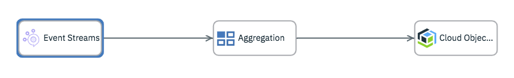
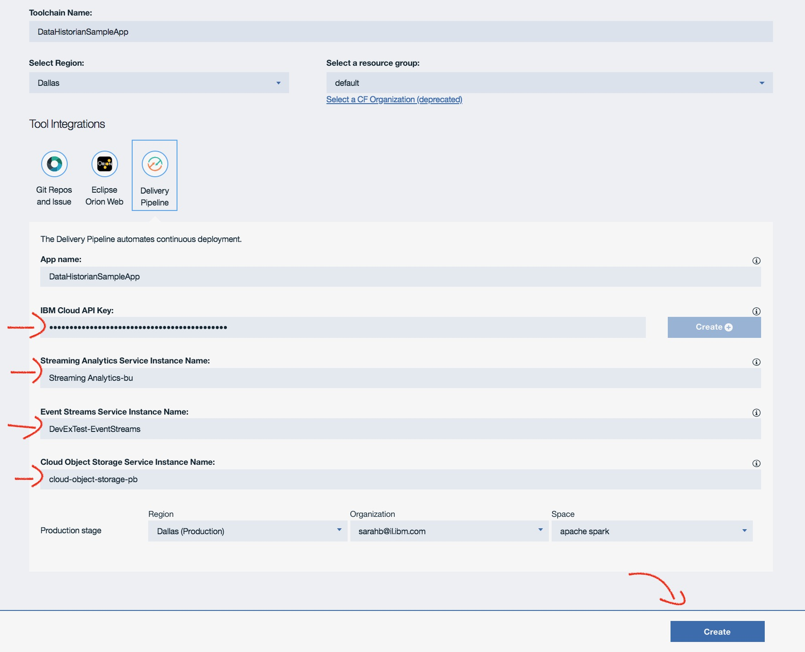
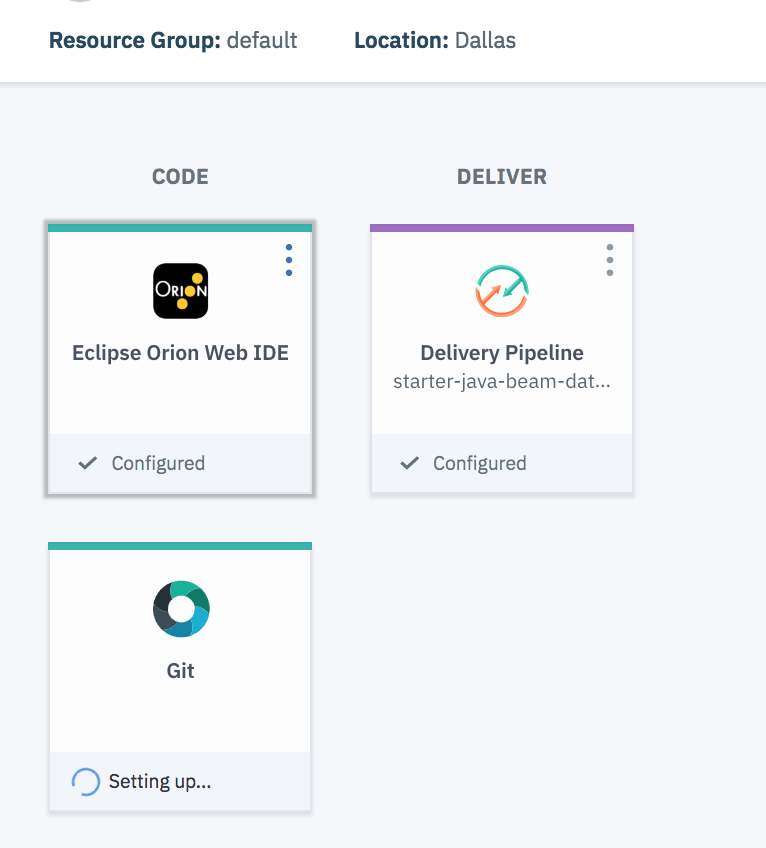

# Creating and Deploying a Data Historian Python Application
A generated IBM Cloud application

### Continuously deliver an app with IBM hosted repos and issue tracking

This sample Python application runs the DataHistorian pipeline.
Data historian is an efficient way to collect and store time series data. The data might come from production lines,
transportation routes, network devices, satellites, and other devices. The data is stored with a time stamp and other
identifying information such as device ID and location.

This sample application will ingest the Data historian data from an Event Streams topic.

The data is then flowed through an aggregation operator. The aggregation operator will calculate the average barometric pressure,
humidity, indoor temperature, and rainfall today for each weather station.
The aggregated tuple data will then flow to a Cloud Object Storage instance to be stored.

## Prereqs
* Create an <a href="https://console.bluemix.net/dashboard/apps" target="_blank">IBM Cloud account</a> if you don't already have one.
* Need to provision the following in IBM Cloud:
  * Streaming Analytics instance - lite plan or any container plan
  * Event Streams instance  - Standard Plan
  * Cloud Object Storage instance
  * Must have Editor permissions on a Toolchain Service in IBM Cloud
* To run locally and to populate Event Streams with sample data, must have Python 3.5 or higher installed.
* Be sure to [populate Event Streams ](#populateES) Data Historian data before running the application.

## To get started, click **Deploy to IBM Cloud**.

This button will open up the Toolchain Create page. Follow the instructions for selecting the
name and region for the toolchain creation, as well as the resource group.

Note: The Resource group selected must contain the Streaming Analytics instance and Cloud Object Storage instance
that are being used.

Then, click **Create**.

On the next page, you will need to insert the names of each service.

Once the toolchain is created, you will see the Git repo where the code has been copied to
and the Delivery pipeline. By clicking on **Deliver pipeline**, the toolchain will
run through the stages of build and and then deploy of the code.

If the deploy flow stage succeeds, then you have successfully deployed your pipeline
and can follow the steps to [monitor](#monitor) the flow.

IF the deploy flow stage fails, click on **view logs and history** to find the failure.
To debug, the deploy script can by found in the git repo under .bluemix/scripts.

## Populating Event Streams topic with Data Historian data
The application that is running will create subscribe to a specific topic, **dataHistorianStarterkitSampleData**, in your Event Streams instance to ingest the Data
Historian data.
This application provides an Event Streams Producer that can be run to create and
populate **dataHistorianStarterkitSampleData** in Event Streams.
Before deploying the flow, run the Producer script to ensure the data is ready for ingest.

##### 1. Clone the starter-python-topology-data-historian code:
In a terminal, run:

$ git clone https://github.com/IBM/starter-python-topology-data-historian.git

##### 2. Insert credentials

Open up producer.py file, and search for "# Paste Events Streams credentials here"
Fill in the relevant service credential information.

        {
            "user": "",
            "password": "",
            "kafka_brokers_sasl": []
        }

To get the service credentials for a service, go to the service instance in IBM cloud.
On the left panel click on **service credentials**. Click **view credentials** from one of the
listed credentials.

##### 3. Run the producer script

$ cd sample_data_producer

$ pip3 install -r requirements.txt

$ python producer.py

## Deploying locally
Alternatively to deploying the application to cloud, the application can be run locally once it's been cloned.

##### 1. Clone the starter-python-topology-data-historian code:
In a terminal, run:

$ git clone https://github.com/IBM/starter-python-topology-data-historian.git

##### 2. Copy vcap-template.json to vcap.json

Fill in the relevant service credential information in the vcap.json.
To get the service credentials for a service, go to the service instance in IBM cloud.
On the left panel click on **service credentials**. Click **view credentials** from one of the
listed credentials.

##### 3. Run the python script
$ pip3 install -r requirements.txt

$ cd src

$ python data_historian.py

## Monitoring your application
Once the application has been successfully deployed, either by running locally or by deploying to cloud,
go to the Streaming Analytics instance that you are using to run the flow and click **LAUNCH**.
This will open the Streaming Analytics console. From the console, you can view and monitor the running flow.

## Troubleshooting

1. If the deploy script fails when deploying to cloud, click on **view logs and history** to see the errors.
IF the script needs to be modified, it can be edited directly in the git repo.
Click on the Git repo from the toolchain view. Drill down into .bluemix/scripts, and open the deploy.sh script.
Any changes made here will be picked up next time you click on **Delivery Pipeline**.